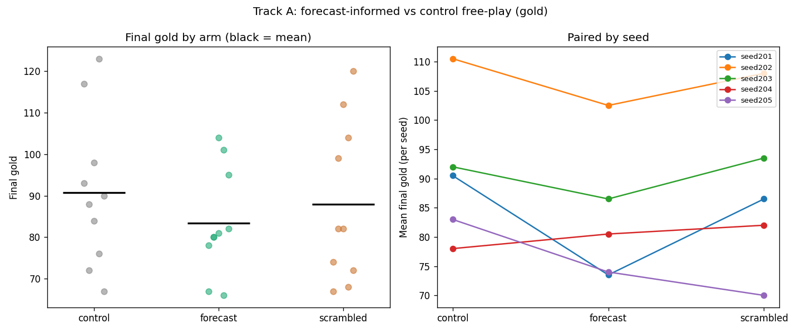

# Forecast-Uplift Study — Results & Engineering Log

**Branch:** `forecast-uplift-study` · **Model:** `google/gemini-2.5-flash` · Status: pilot

**Question.** Does giving an LLM *game-true probabilities* (Monte-Carlo–estimated
event odds) improve a downstream outcome — **gold accumulated** — in FreeCiv?
See `forecast_uplift_study.md` for the full design and the literature that shaped it
(accuracy≠value; engineer positive Value-of-Information; add a scrambled-forecast
arm; measure outcomes not forecast fidelity).

## Two experiments

### Track B — macro decision (government choice): **negative by construction (low VOI)**
Design: at a checkpoint the LLM picks a government to maximize gold; we MC-simulate
each option under the AI and score the chosen option's gold.

**Finding: this lever has near-zero Value-of-Information, so no forecast can help.**
On *clean, single-run* game data the four governments produce almost identical gold
(seed100 T45: Despotism 246 / Monarchy 234 / Republic 246 / Democracy 236 — spread
**12** on a ~240 base). Root cause, established by tracing individual games: after a
forced government change the **built-in AI reverts it within ~2 turns** (revolts back
toward its own target government), so a one-shot macro intervention is washed out by
~15 turns of AI play. (An early probe that showed a large 105→385 spread turned out to
be an artifact of **commingled savegames from multiple past runs** in the recordings
directory — fixed by regenerating clean single-run games.) Per the value-of-information
literature, when the optimal action barely changes, forecasts cannot add value — a
*structural* null. This is why we pivoted the headline experiment to free-play.

### Track A — free-play (the headline A/B)
The Gemini agent (ported BaseLang from CivRealm's LLM baseline) **actually plays**
FreeCiv as player 0 with the explicit objective *"maximize your gold by turn H"*, and
we compare three arms of the **same model, independent instances, same seed**:

- `control` — objective only
- `forecast` — objective + a game-true `p_mc` table (6 events × 2 horizons), re-shown
  every turn (prepended to every actor prompt)
- `scrambled` — the same probability values shuffled across events (isolates "acts on
  the *true* numbers" from "acts on *any* numbers")

Outcome = final gold. Setup: 5 seeds, 2 AI opponents (see "survival" below), horizon 16.

## Key engineering findings (things that were quietly wrong)
1. **The ported agent was 100% random at first.** Three chained bugs each silently fell
   back to a random action: (a) `num_tokens_from_messages` raised `NotImplementedError`
   for non-GPT models → threw before the LLM was ever called; (b) `parse_response` only
   stripped to the `{...}` span when braces were *unbalanced*, so Gemini's ```json-fenced
   (balanced) output failed to parse; (c) a `%`-style `fc_logger` call with extra args
   crashed the decision thread when the model picked an out-of-list action. After fixes:
   real `finalDecision`s, 0 parse-failures, 0 random-timeouts; the agent chooses
   gold-relevant actions like **`produce Coinage`** (convert production→gold) and
   `produce Settlers`.
2. **Checkpoint-loading + the LLM wrapper is blocked** by a ruleset incompatibility in
   the 2-yr-old docker image (`goods_good.helptext` missing) — base-env fork rollouts
   load fine, but the LLM wrapper reads ruleset help-text the image lacks. So free-play
   starts from a fresh game, not a mid-game checkpoint.
3. **Survival.** With 5 AI opponents the weak agent's civ is wiped by ~turn 12 (defeat),
   before the forecast horizons even arrive. Reducing to 2 opponents lets it survive to
   the horizon, so the outcome is real "gold at turn 16," not "gold at death."

## Results (Track A) — 30 games, 5 seeds × 3 arms × 2 repeats

Final gold (turn 16), mean over 10 games/arm:

| arm | mean gold | median | range |
|-----|-----------|--------|-------|
| control   | **90.8** | 89 | 67–123 |
| scrambled | 88.0 | 82 | 67–120 |
| forecast  | **83.4** | 80 | 66–104 |

Paired by seed (`forecast − control`): seed201 **−17**, seed202 −8, seed203 −6,
seed204 **+2**, seed205 −9.

- **`forecast − control` = −7.4 gold, 95% bootstrap CI [−13.1, −1.9] (excludes 0).**
  4 of 5 seeds negative. Giving the agent the game-true forecast table **reduced** its
  gold by ~8% at the pilot level.
- **`forecast − scrambled` = −4.6, 95% CI [−9.5, +0.6] (includes 0).** The true forecast
  is not distinguishable from shuffled numbers; both are ≤ control.

**Headline: a clean, mildly *negative* result.** For a weak agent (Gemini 2.5 Flash) on
mostly-peaceful maps, injecting a 6-event probability table each turn slightly *hurt* gold
accumulation rather than helping. Because `forecast ≈ scrambled ≤ control`, the effect is
consistent with **the forecast table acting as distraction / added cognitive load** rather
than as usable decision-relevant information — exactly the failure mode the value-of-
information and advice-taking literature predicts when a forecast has low decision-
relevance and the decision-maker is weak ("bare numbers are hard to use").



## Honest caveats
- **Weak agent, short horizon, small gold** (~60–110 at turn 16): low statistical power;
  n=5 seeds is a pilot, not a definitive test.
- **aifill=2 games are peaceful early**, so the forecasts are dominated by
  "you're expanding / ahead-or-behind" rather than actionable war/defense signals —
  weaker decision-relevance (again, the VOI caveat).
- These are the right *directions* to strengthen next: a stronger model (Gemini 2.5 Pro),
  a mid-game checkpoint start (needs the ruleset fix), and forecasts engineered to have
  demonstrable VOI.
