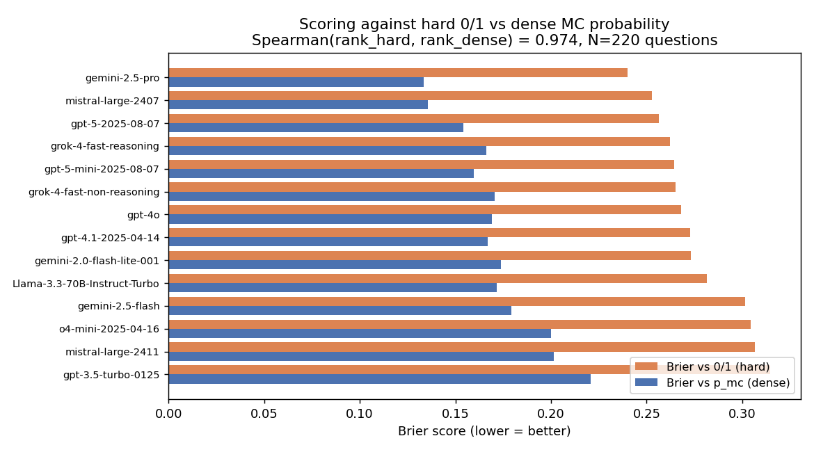
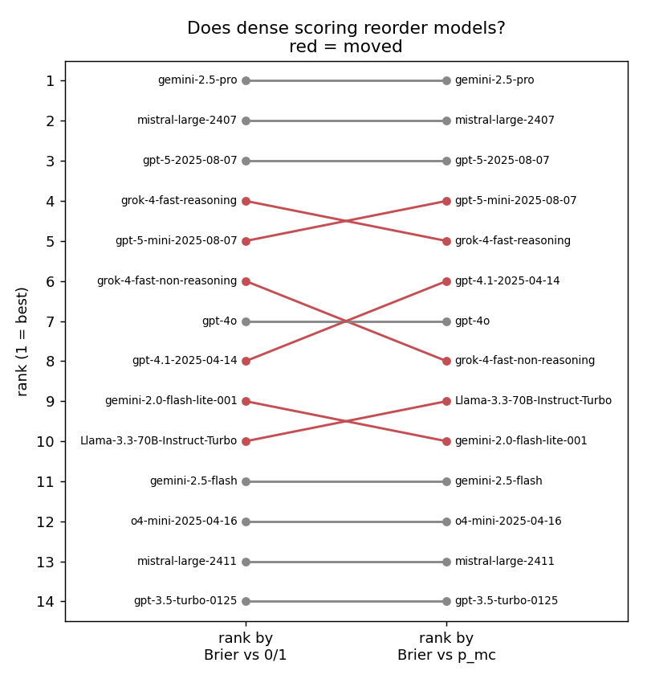
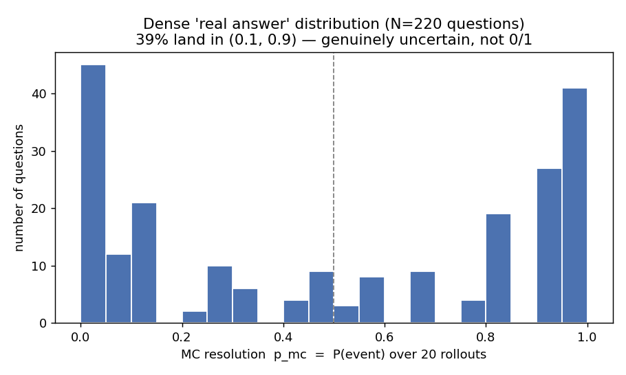
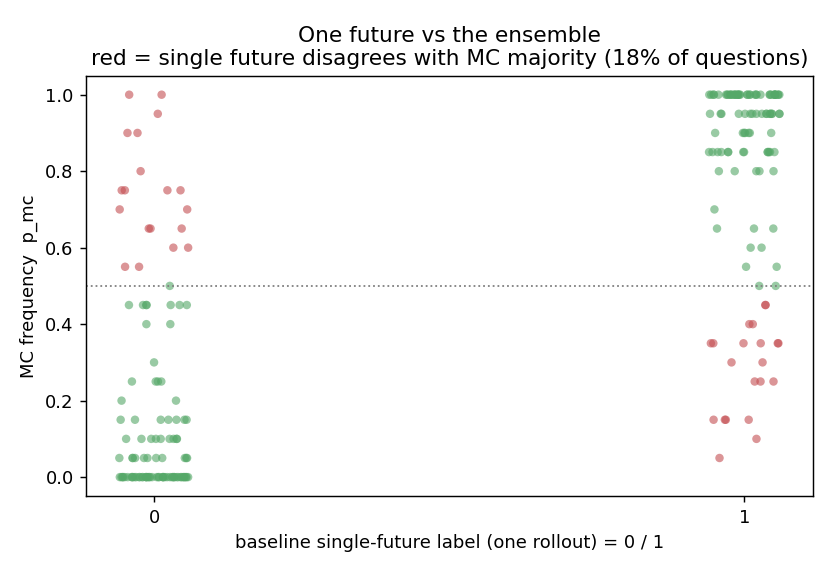

# Dense (Monte-Carlo) resolution vs hard 0/1 labels

Does scoring forecasters against a **real-valued** simulated probability change
how they rank, versus scoring against the usual **hard 0/1** outcome? This
experiment builds the dense signal from Freeciv itself and compares the two.

## Result in one line

Across **220 binary questions** (4 games, horizon H1) and **14 models**, ranking
models by Brier-vs-`p_mc` instead of Brier-vs-0/1 gives **Spearman ρ = 0.974** —
the ordering is almost unchanged (max move ±2 places; top-3 and bottom-4
identical). But every model's Brier *drops*, and **18%** of the hard labels sit
on the *minority* side of what actually happens across rollouts.




## Methodology

**Worlds.** The original benchmark games (`seed0–10`) whose saves are hosted
off-repo were unavailable, and `run_world.py --seed N` no longer reproduces them
bit-for-bit (engine/ruleset drift since they were generated). So this is a
*self-consistent* study on freshly regenerated worlds: I regenerated `seed0–3`
deterministically to turn 96, generated the turn-60 world report and the binary
question set for each with the existing `prepare_benchmark.py` pipeline (220
questions total, all horizon H1: observed at turn 60, resolved at turn 90).

**Hard label (0/1).** Each question's canonical outcome is taken from a single
*baseline rollout*: load the turn-60 save, continue to turn 90 with the original
RNG state (no reseed), all five civs under Freeciv AI — exactly the
single-future resolution the benchmark uses today.

**Dense label (`p_mc`).** From the *same* turn-60 save and the *same* simulator
config, I run 20 additional rollouts, each reseeding Freeciv's RNG to a different
value (the `set_rng_from_seed` / save-edit method from
[monte_carlo_rollouts.md](monte_carlo_rollouts.md)). Each rollout is serialized
with `MetricsCollector` and resolved with the production `QuestionResolver`, so
the dense answer is computed by exactly the same code as the hard one. `p_mc` is
the fraction of the 20 rollouts in which the event occurs. Because the baseline
and the 20 reseeds share one simulator config, the hard label is literally one
draw from the same distribution `p_mc` estimates — they are directly comparable.

**Predictions.** 14 models were evaluated fresh on the turn-60 world reports
(the 2 Anthropic models and DeepSeek-V3 were dropped on API-auth failures). Each
model sees the report and outputs a probability per question, scored with Brier
against both the hard label and `p_mc`.

**Pipeline:** `run_world` → `generate_data_batch` → `prepare_benchmark` →
`mc_resolve.py` (rollouts + resolution) and `evaluate_llm_forecasts_parallel.py`
(predictions) → `score_mc_vs_binary.py` (Brier + Spearman) → `plot_mc_results.py`.

## What the dense signal looks like



The `p_mc` distribution is U-shaped: most questions are nearly determined by
turn 60 (a stronger civ stays ahead), so the hard label is usually fine. But
**~39%** of questions land in (0.1, 0.9) — genuinely stochastic outcomes where a
0/1 label is throwing away most of the information.



The cost of the single-future label: in **18%** of questions the one canonical
rollout resolves on the *opposite* side of the MC majority (red points). For
those, the benchmark currently rewards whichever forecaster best predicted a
coin-flip's particular landing — noise, not skill.

## Interpretation

- **Ranking is robust (ρ ≈ 0.97).** Dense scoring is *not* going to overturn a
  leaderboard. The hard-label noise mostly blurs near-ties; it doesn't
  systematically favor one model class. Movement is confined to the densely
  packed middle (e.g. `grok-4-fast-non-reasoning` 6→8, `gpt-4.1` 8→6).
- **But the per-question signal is much richer.** Every Brier falls because a
  calibrated 0.7 is "right" against `p_mc≈0.7` but looks half-wrong against a
  0/1 that happened to land at 0. This is exactly the sparsity that makes RLVR
  on forecasting hard: against `p_mc` a forecaster gets smooth, immediate credit
  for being approximately right, instead of a 0/1 that's dominated by simulator
  variance on ~1 in 5 questions.
- **Caveat — config dependence.** `p_mc` is the event frequency *under this
  simulator config* (all-AI, concurrent turns, this ruleset). It is the "real
  chance" within the simulated world, not a metaphysical truth, and it would
  change under a different policy for the civs. The forecaster and the resolver
  must share the config for the signal to be aligned.
- **Scope.** 4 worlds, one horizon (30 turns), N=20 rollouts, 14 models. The
  rank correlation is already tight, but N=20 gives `p_mc` a ±0.1-ish error;
  for RLVR you'd want more rollouts on the interior questions and more worlds.

## Reproduce

```bash
# 1. regenerate worlds (deterministic) + build questions/reports
for s in 0 1 2 3; do
  PYTHONPATH=src uv run python scripts/run_world.py --seed $s --max_turns 95 --quiet
done
PYTHONPATH=src uv run python scripts/generate_data_batch.py --output-dir data/games_mc --force
for s in 0 1 2 3; do
  PYTHONPATH=src uv run python scripts/prepare_benchmark.py --game-id seed$s \
    --snapshot-turn 60 --games-dir data/games_mc --output-dir data/questions_mc --force
done

# 2. dense + baseline resolution (20 reseeds + 1 baseline per game)
for s in 0 1 2 3; do
  PYTHONPATH=src uv run python scripts/mc_resolve.py --game-id seed$s --base-seed $s \
    --snapshot-turn 60 --resolution-turns 90 --rng-seeds $(seq 1 20) --baseline \
    --questions data/questions_mc/seed$s/questions.json --output tmp/mc_resolve/seed${s}_h1.json
done

# 3. fresh predictions
PYTHONPATH=src uv run python scripts/evaluate_llm_forecasts_parallel.py \
  --data-dir data/questions_mc --horizon H1 --question-type binary --all \
  --models <models...> --output tmp/mc_eval/eval.json

# 4. score + plot
uv run python scripts/score_mc_vs_binary.py --eval tmp/mc_eval/eval.json \
  --mc tmp/mc_resolve/seed*_h1.json --output tmp/mc_eval/ranking_final.json
uv run python scripts/plot_mc_results.py --ranking tmp/mc_eval/ranking_final.json \
  --mc tmp/mc_resolve/seed*_h1.json --outdir docs/assets/mc_dense
```
