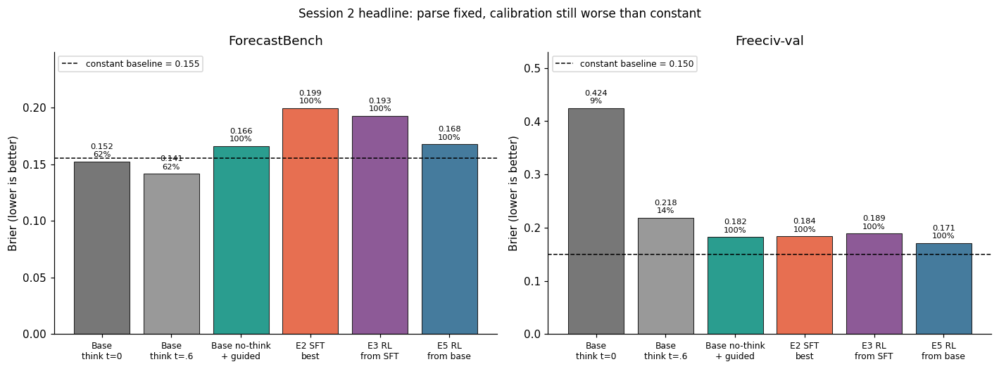
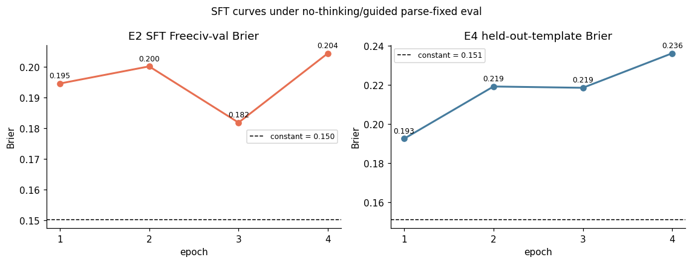
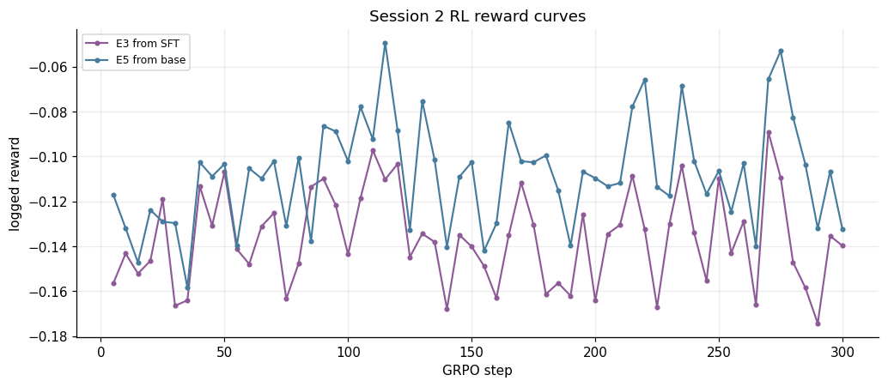
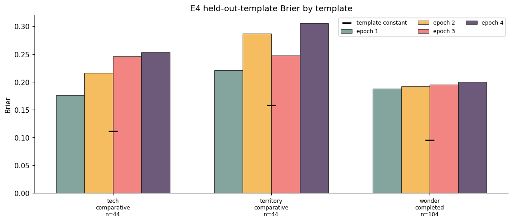

# Session 2 Report: RLVR-on-Freeciv Transfer Followup

**Date**: 2026-06-14  
**Companion log**: [SESSION2_JOURNAL.md](SESSION2_JOURNAL.md)  
**Plots**: [plots/v2/](plots/v2/)

## Executive Summary

Session 2 tested three hypotheses about the negative transfer observed in Session 1:

1. The poor transfer might be a format/parsing problem rather than a learning problem.
2. The SFT checkpoint might harm downstream RL transfer.
3. The original Freeciv SFT improvement might reflect memorization rather than generalizable forecasting.

The results were mostly negative. Disabling Qwen3 thinking mode and using guided decoding made parsing essentially perfect, but the resulting probabilities still did not beat a constant predictor. The cleaned-up SFT run did not reproduce the Session 1 Freeciv-val gain. RL from base performed better than RL from the SFT checkpoint, but neither beat the constant baseline. The template-holdout experiment was the clearest result: SFT trained on seven Freeciv templates failed to generalize to the three held-out templates.

The overall interpretation is that the dense Freeciv `p_mc` signal did not transfer to ForecastBench, and the Freeciv learning signal did not generalize robustly across templates under the Session 2 evaluation protocol.

## Experimental Setup

The base model was `Qwen/Qwen3-8B`. The main evaluation suites were:

- **ForecastBench**: 401 real-world forecasting questions.
- **Freeciv-val**: 57 held-out Freeciv questions from the standard validation split.
- **E4 template-holdout Freeciv split**: 192 held-out questions from three templates: `wonder_completed`, `territory_comparative`, and `tech_comparative`.

The primary metric was Brier score, lower is better. Each reported Brier is compared to a constant baseline computed on the parsed subset for that condition. Parse rate is shown because low parse rate changes the subset being scored.

Session 2 used two evaluation regimes:

- **Thinking-on chat eval**: Qwen3 chat template with default thinking behavior.
- **No-thinking guided eval**: Qwen3 chat template with thinking disabled and guided decoding to force a final parseable `PROBABILITY:` line.

The second regime was added to measure probability quality after removing most parse failures.

## Prior Session 1 Context

Session 1 found that raw-format SFT improved Freeciv-val but degraded ForecastBench. RL then mostly removed the Freeciv gain.

| condition | eval mode | FB parse | FB Brier | FB vs const | Freeciv parse | Freeciv Brier | Freeciv vs const |
|---|---|---:|---:|---:|---:|---:|---:|
| S1 base Qwen3 greedy | raw | 146/401 (36%) | 0.182 | ~+15% | 55/57 (96%) | 0.197 | ~+31% |
| S1 base Qwen3 t=0.6 | raw | 372/401 (93%) | 0.174 | ~+10% | 48/57 (84%) | 0.230 | ~+52% |
| S1 SFT ep4 | raw | 322/401 (80%) | 0.210 | +27.5% | 56/57 (98%) | 0.147 | -3.3% |
| S1 post-RL | raw | 393/401 (98%) | 0.176 | +11.5% | 56/57 (98%) | 0.215 | +44.0% |

These numbers motivated the Session 2 experiments below.

## E1: Chat-template Base Evaluation

E1 tested whether Qwen3's native chat template and thinking mode would improve base-model parsing and calibration.

| condition | FB parse | FB Brier | FB vs const | Freeciv parse | Freeciv Brier | Freeciv vs const |
|---|---:|---:|---:|---:|---:|---:|
| E1 chat, thinking on, t=0 | 247/401 (61.6%) | 0.152 | +8.0% | 5/57 (8.8%) | 0.424 | +280.4% |
| E1 chat, thinking on, t=0.6 | 248/401 (61.8%) | 0.141 | +6.7% | 8/57 (14.0%) | 0.218 | +38.3% |

Chat-template evaluation with thinking enabled improved ForecastBench parse rate relative to raw greedy decoding, but parse remained low. On Freeciv-val, parse rate became very low. This result did not support the simple hypothesis that the native chat template alone fixes evaluation.

An additional base-model diagnostic disabled Qwen3 thinking mode and used guided decoding to force a parseable probability.

| condition | FB parse | FB Brier | FB vs const | Freeciv parse | Freeciv Brier | Freeciv vs const |
|---|---:|---:|---:|---:|---:|---:|
| Base no-thinking + guided, t=0 | 401/401 (100%) | 0.166 | +6.9% | 57/57 (100%) | 0.184 | +22.7% |
| Base no-thinking + guided, t=0.6 | 401/401 (100%) | 0.166 | +7.1% | 57/57 (100%) | 0.182 | +21.3% |

This solved parsing, but not calibration. The base model still lost to a constant predictor on both suites.

## E2: Chat-template SFT

E2 re-ran SFT using message-format training records, so the model was trained through the chat template rather than raw prompt text. Checkpoints were evaluated with no-thinking guided decoding.

| E2 checkpoint | Freeciv parse | Freeciv Brier | Freeciv vs const |
|---|---:|---:|---:|
| checkpoint-69 | 57/57 (100%) | 0.195 | +29.5% |
| checkpoint-138 | 57/57 (100%) | 0.200 | +33.3% |
| checkpoint-207 | 57/57 (100%) | 0.182 | +21.1% |
| checkpoint-276 | 57/57 (100%) | 0.204 | +36.1% |

The best checkpoint by Freeciv-val Brier was checkpoint 207. Its full eval was:

| condition | FB parse | FB Brier | FB vs const | Freeciv parse | Freeciv Brier | Freeciv vs const |
|---|---:|---:|---:|---:|---:|---:|
| E2 checkpoint-207 | 401/401 (100%) | 0.199 | +28.6% | 57/57 (100%) | 0.184 | +22.3% |

E2 did not reproduce the Session 1 result where SFT beat the Freeciv constant baseline. Under parse-fixed evaluation, all E2 checkpoints were worse than constant on Freeciv-val, and the selected checkpoint was substantially worse than constant on ForecastBench.

## E3: RL from the E2 SFT Checkpoint

E3 ran GRPO from E2 checkpoint 207 using the corrected RL settings: four generations, 1024-token completions, low KL coefficient, and a smaller malformed-output penalty.

The reward curve did not show meaningful improvement. The first four logged rewards averaged `-0.1496`; the last four averaged `-0.1520`.

| condition | FB parse | FB Brier | FB vs const | Freeciv parse | Freeciv Brier | Freeciv vs const |
|---|---:|---:|---:|---:|---:|---:|
| E3 RL from SFT | 401/401 (100%) | 0.193 | +24.2% | 57/57 (100%) | 0.189 | +25.9% |

E3 improved ForecastBench relative to the E2 selected checkpoint, but it remained worse than both the constant baseline and the no-thinking guided base model. It also worsened Freeciv-val relative to E2.

## E4: Template-holdout SFT

E4 tested whether Freeciv SFT generalized across templates. The model trained on seven templates and was evaluated on three held-out templates.

Overall held-out-template results:

| E4 checkpoint | held-out parse | held-out Brier | vs const |
|---|---:|---:|---:|
| checkpoint-56 | 192/192 (100%) | 0.193 | +27.5% |
| checkpoint-112 | 192/192 (100%) | 0.219 | +45.2% |
| checkpoint-168 | 190/192 (99.0%) | 0.219 | +46.1% |
| checkpoint-224 | 192/192 (100%) | 0.236 | +56.5% |

Per-template results:

| held-out template | n | template constant | epoch 1 | epoch 2 | epoch 3 | epoch 4 |
|---|---:|---:|---:|---:|---:|---:|
| tech_comparative | 44 | 0.112 | 0.176 | 0.216 | 0.246 | 0.253 |
| territory_comparative | 44 | 0.158 | 0.221 | 0.287 | 0.248 | 0.305 |
| wonder_completed | 104 | 0.095 | 0.188 | 0.192 | 0.195 | 0.200 |

Every checkpoint was worse than the constant baseline on the held-out split. Every held-out template was also worse than its template-specific constant baseline. This is the strongest evidence from Session 2 that the Freeciv SFT signal did not generalize across question templates.

## E5: RL from Base

E5 ran GRPO directly from the base model, without an SFT adapter. The reward curve showed mild improvement: the first four logged rewards averaged `-0.1300`, while the last four averaged `-0.1187`.

| condition | FB parse | FB Brier | FB vs const | Freeciv parse | Freeciv Brier | Freeciv vs const |
|---|---:|---:|---:|---:|---:|---:|
| E5 RL from base | 401/401 (100%) | 0.168 | +8.1% | 57/57 (100%) | 0.171 | +13.9% |

E5 was better than E3 on both ForecastBench and Freeciv-val, which suggests the E2 SFT initialization was harmful for this RL setup. However, E5 still did not beat the constant baseline on either suite.

## Hypothesis Assessments

### H1: Format gap, not learning gap

This hypothesis was partially supported. The format/parsing layer mattered a lot: no-thinking guided decoding raised parse rates to 100%. However, after parse was fixed, the probabilities still did not beat constant baselines. So the format gap explains parse failures, but not the lack of forecasting improvement.

### H2: SFT initialization harmed RL transfer

This hypothesis was supported directionally. RL from base outperformed RL from the SFT checkpoint:

- ForecastBench: E5 `0.1677` vs E3 `0.1928`.
- Freeciv-val: E5 `0.1711` vs E3 `0.1891`.

The more conservative conclusion is that this SFT checkpoint was a bad initializer for transfer. E5 itself was not a successful forecasting model, since it still lost to constant baseline.

### H3: In-distribution memorization rather than general learning

This hypothesis was supported by E4. Template-holdout SFT failed on all held-out templates and all checkpoints. This suggests the Session 1 Freeciv gain, where observed, was not robust evidence of template-level generalization.

## Limitations

The main limitation is that Session 2 used a parse-fixed evaluation protocol that was not perfectly aligned with the training protocol. The SFT and RL prompts used chat-template formatting, while the decisive evals disabled thinking and used guided decoding. This is acceptable for diagnosing probability quality under forced parseability, but it is not a fully matched train/eval setup.

The Freeciv-val split is also small: 57 examples for the standard validation set. E4 is larger at 192 held-out examples and is therefore more informative about template generalization, but it still covers only one held-out template set.

Finally, all RL conclusions are based on single runs. E5 beating E3 is directionally informative, but not a substitute for a seeded comparison.

## Conclusions

Session 2 did not find evidence that dense Freeciv Monte Carlo targets transfer to ForecastBench. It also did not find robust evidence that SFT learns a template-general Freeciv forecasting skill.

The most important empirical findings are:

1. Parse failures can be mostly eliminated with no-thinking guided decoding.
2. Eliminating parse failures does not make the model beat constant baselines.
3. Chat-template SFT did not reproduce the Session 1 Freeciv-val win.
4. RL from base was better than RL from SFT, but still worse than constant.
5. Template-holdout SFT failed clearly.

The next useful experiment is an aligned no-thinking training and evaluation run: train SFT and RL with thinking disabled, evaluate both guided and unguided/two-pass parsing, and require Freeciv template-holdout performance to beat constant before returning to ForecastBench transfer experiments.
