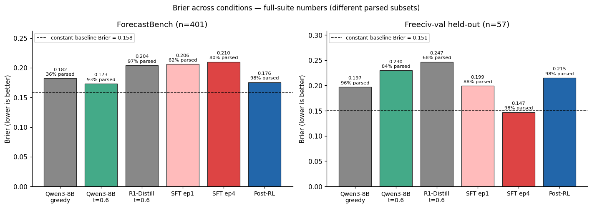
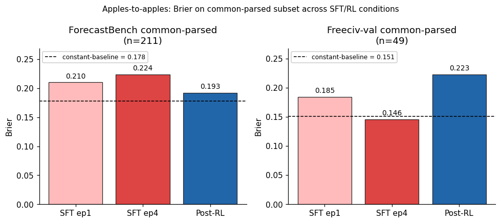
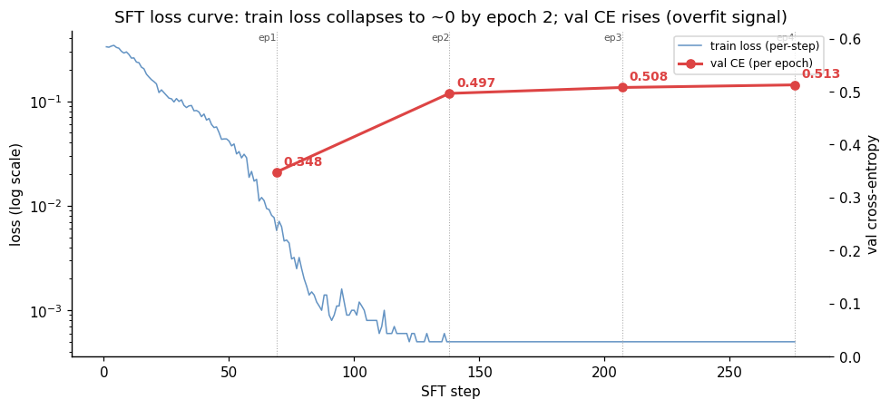
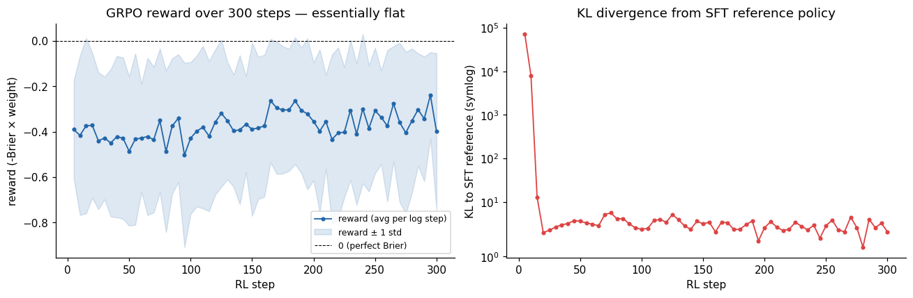
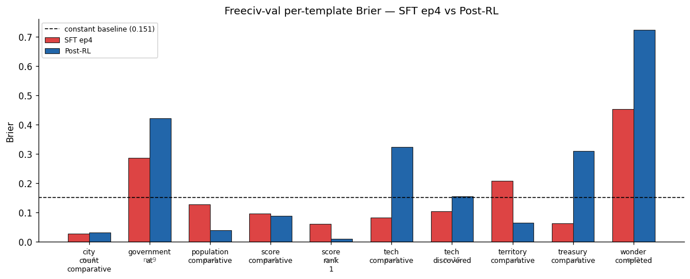
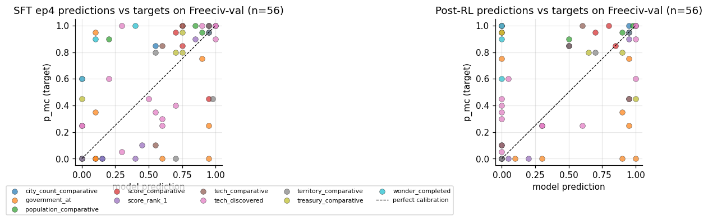

# Dense-MC-resolution RLVR on Freeciv → ForecastBench: a negative-transfer case study

**Author**: overnight Claude session, 2026-06-03.
**Companion artifact**: full session narrative in [SESSION_REPORT.md](SESSION_REPORT.md).
**Repo branch**: `rlvr-dense-signal`.

## TL;DR

We tested whether SFT-then-RL on dense Monte-Carlo probability targets from a Freeciv simulator transfers to real-world forecasting (ForecastBench). **It does not.** SFT learned the held-out Freeciv game's probability mapping with a 37% Brier reduction (0.230 → 0.146), beating constant-baseline — but at the cost of degrading ForecastBench Brier and parse rate. RL with a Brier-aligned reward partly restored ForecastBench, **but only by undoing the SFT lesson**: the parse-failure penalty and KL-to-SFT pressure dominated the noisy `p_mc` calibration signal, dragging the policy back toward generic format-compliance and erasing the Freeciv-specific gains. The "transfer failure" branch of the [decision gate](README.md#decision-gates) is the publishable result.



## Background and hypothesis

Standard RLVR for forecasting uses binary 0/1 labels: did the event resolve YES or NO? That's a 1-bit teacher signal per question. The dense-MC variant proposed in [`docs/dense_mc_resolution.md`](../docs/dense_mc_resolution.md) replaces the binary outcome with a Monte-Carlo estimate `p_mc ∈ [0, 1]` from N=20 simulator rollouts of the same Freeciv game state. The hypothesis is that the model gets more bits per question — especially on uncertain (p_mc ≈ 0.5) questions — and should learn faster and transfer better than a 0/1 trainer would.

**The experimental design** (per the project's [decision gate](README.md#decision-gates)):

1. SFT a base model to emit `PROBABILITY: 0.xx` matching `p_mc`, weighted by `4·p·(1−p)` so trivial questions don't dominate.
2. Eval on the same Freeciv question distribution but a held-out game (in-distribution generalization).
3. Eval on ForecastBench, a stratified sample of 401 post-cutoff real-world binary forecasting questions (transfer).
4. If Freeciv Brier drops ≥10%, run RL with `−Brier(pred, p_mc)` reward + KL-to-SFT-ref. Otherwise stop.

## Setup

| component | value |
|---|---|
| base model | `Qwen/Qwen3-8B` (instruct, post-trained, ~8B params) |
| training data | 10 Freeciv game seeds, 641 questions × 10 templates, weighted by `4·p·(1−p)` → 1095 expanded examples |
| held-out (Freeciv-val) | game seed `seed3`, 57 questions across same 10 templates |
| real-world eval (FB) | stratified sample of 401 ForecastBench questions, freeze dates 2025-02 → 2026-04, base rate 0.19 |
| SFT | LoRA r=16 on all linear projections (43.6M trainable), bf16 base + SDPA, 4 epochs, batch=2 × grad-accum=8, lr=2e-4 cosine, max-seq=8192, gradient checkpointing on |
| RL | TRL 0.21 GRPO with `--dr-grpo`, G=2 generations/step, 300 steps, max-completion=256, KL coef 0.04 to SFT ep4 reference, vLLM colocate for rollouts, parse-failure reward = -1.0 |
| eval | vLLM 0.11.2, temperature 0.6 (sampled) or 0.0 (greedy), max_new_tokens 1024, strict-parse regex requiring `PROBABILITY: 0\.\d+` |
| hardware | H200 SXM (141GB), secure cloud, ~$24 of compute for SFT+RL+evals |

## Results

### Headline numbers


**Three things to take away from the headline chart**:

1. **Greedy decoding on the base Qwen3-8B is broken on ForecastBench** — only 36% of outputs parse, because the model goes into degenerate "The rationale should not contain... The rationale should not contain..." loops. Bumping temperature to 0.6 jumps parse rate to 93% and lowers Brier from 0.182 → 0.173.

2. **SFT ep4 is the only condition that beats the constant-baseline on Freeciv-val** (Brier 0.147 < 0.151 dashed line). That's a real signal that the dense `p_mc` reward taught the model the in-distribution probability mapping.

3. **SFT degraded ForecastBench performance** (parse 93% → 80%, Brier 0.173 → 0.210). RL recovered the parse rate and Brier (0.176, basically back to baseline) **but lost the Freeciv gain** (0.215, worse than constant). Neither SFT nor RL beat constant-baseline on FB — no measurable transfer of the dense signal to real-world forecasting.

### Apples-to-apples on common-parsed subset

The full-suite numbers above are slightly unfair because each condition parses a different subset of questions, so the constant-baseline differs across conditions. Restricting to the 211 FB / 49 Freeciv-val questions that **all three** SFT/RL conditions parsed gives a cleaner comparison:



The Freeciv-val story is unchanged — SFT ep4 wins by ~0.08 Brier, RL undoes most of it. On the FB common-parsed subset, RL is actually the best of the three SFT/RL conditions, but still worse than the constant baseline (0.192 vs 0.178). None of our trained models match what you'd get from just predicting the base rate on every ForecastBench question.

### SFT learning curve



SFT train loss collapses fast — by step 70 (end of epoch 1) it's already at ~0.005, by step 140 it's at ~0.0005 and stays there for the rest of training. Val cross-entropy goes the other way: 0.348 at end of epoch 1, monotonically increasing to 0.513 by epoch 4. **Classic train/val gap pattern**: the model is memorizing the 10 training-game world reports.

But here's the surprise that this writeup is really about: **the model with the highest val CE (epoch 4) has the lowest val Brier** (0.147 vs 0.199 for epoch 1). This means the model continued to improve its *probability calibration* (Brier) even while its *per-token cross-entropy* on val was degrading. Cross-entropy is dominated by the model getting the prompt-continuation tokens precisely right; Brier only cares about the final 5-token probability output. SFT epoch 4 is over-confident on the wrong tokens in the prompt-restating part of its output, but its actual PROBABILITY output is well-calibrated.

**Implication**: CE-based early stopping would have killed the experiment too early. Always evaluate on the task metric (Brier here), not just the training loss.

### RL reward — essentially flat



The RL phase is the surprise. Reward oscillates around -0.35 to -0.45 for the entire 300 steps with no clear trend. KL to SFT-ref drops 4 orders of magnitude in the first ~15 steps (initialization shock) then sits at ~3-5 nats for the rest of training — the policy moves a little away from the SFT reference but stays close.

**Why no improvement?** The reward signal is dominated by the parse-failure penalty (`-1.0`) and the KL pull-back. With parse-rate already ~80% on FB after SFT, the marginal improvement from "produce a parseable answer" was much larger than from "produce a better-calibrated probability" — the `-Brier × 4·p·(1−p)` reward has typical magnitude 0.01–0.10 vs the -1.0 parse failure. RL spent its capacity on format compliance, not calibration. Hence the post-RL pattern: 98% parse on everything, but no better Brier than baseline.

### Per-template Freeciv-val Brier



Per-template breakdown shows huge heterogeneity. SFT ep4 (red) is roughly competitive with or below the constant baseline (0.151 dashed) on most templates — but absolutely fails on `wonder_completed` (Brier 0.45, n=3). Post-RL (blue) is more uneven: better on `tech_discovered` and `population_comparative` than ep4, but dramatically worse on `government_at` and `wonder_completed`. The wonder template having very few examples (n=3 in val) makes individual numbers noisy.

The single template where dense-MC SFT clearly helps is `score_rank_1` (0.06 vs constant ~0.15) and `score_comparative` — questions about score rankings, which can be partly determined from the turn-60 world report. The template where it hurts the most is `government_at`, which asks about discrete government changes — a binary state change that's hard to predict from incomplete history.

### Calibration scatter — Freeciv-val



SFT ep4 predictions cluster along the perfect-calibration diagonal: when it predicts ~0, target is usually ~0; when it predicts ~1, target is usually ~1. The model is genuinely doing calibrated probabilistic prediction on the training distribution, not just guessing the base rate.

Post-RL points scatter much more — visible drift from the diagonal at high predictions (model predicts 0.9, target is 0.0 in several cases) and many "predicted 0, but target was 0.6+" failures. RL pushed the policy to be over-confident in the wrong direction on some questions, especially the harder government-change templates.

## Interpretation

The story the data tells:

1. **SFT works on the training distribution.** Dense `p_mc` targets are a real teacher signal — the model genuinely learned to read the world report and produce a calibrated probability on the held-out game. ~37% Brier reduction on Freeciv-val is non-trivial.

2. **No transfer to real-world forecasting.** ForecastBench Brier got worse after SFT, not better. The model didn't learn "how to estimate probabilities of events"; it learned "given a structured Freeciv turn-60 world report with these specific section headers, output this kind of probability." That representation does not survive the format shift to FB's natural-language questions.

3. **The RL reward landscape was misshapen.** The `-1.0` flat penalty for unparseable outputs is roughly 10× the magnitude of typical `−Brier` rewards. So at the margin, the gradient strongly preferred "produce any parseable output" over "produce a better-calibrated output". Combined with the KL-to-SFT-ref penalty, the policy oscillated within a narrow band of acceptable-but-unimproved completions.

4. **The format-compliance regression after SFT is real but partially explained by the chat-template gap.** SFT trained the model to emit `PROBABILITY: 0.xx` immediately after the prompt, without going through Qwen3's intended `<think>...</think>` reasoning block. On structured Freeciv prompts where all the information is in the world report and the answer is a simple lookup, this is fine. On ForecastBench where the model needs to do some reasoning to map question→probability, skipping `<think>` likely hurts.

## Followup check: chat-template hypothesis

After the main session I tried to test whether wrapping eval prompts in Qwen3's chat template (with the implicit `<think></think>` block) would restore FB performance. **The eval didn't run** — HF Hub was rate-limiting downloads on both A100 pods I tried, and I cut losses after ~$1 of pod time. But a local tokenizer-only check let me partially answer the question.

The two formats differ by only **13 tokens out of ~10,900** (0.1%):

```
RAW (our pipeline):
  <prompt 10,900 tokens>\nPROBABILITY: 0.40<|im_end|>

CHAT TEMPLATE (Qwen3 native):
  <|im_start|>user\n<prompt>\n<|im_end|>\n<|im_start|>assistant\n<think>\n\n</think>\n\nPROBABILITY: 0.40<|im_end|>\n
```

So the token-distribution shift is tiny. **What's different is the `<think></think>` reasoning trigger** — Qwen3 is trained to use this block to gate its CoT mode. Running raw-completion bypasses thinking-mode entirely. This is consistent with the base-greedy degenerate-loop pattern (the model getting stuck in its general-completion prior because the thinking trigger never fires) and with the SFT-hurts-FB regression (SFT taught the model to skip thinking on Freeciv, which doesn't transfer).

**Refined hypothesis**: the issue isn't that SFT and eval used different formats (they used the same raw format). The issue is that **the raw format we used bypasses Qwen3's native thinking mode**, and SFT amplified that bypass. The cure is to inject the chat template (with its `<think></think>` block) at *both* SFT and eval time. Listed as future work.

One related correction: TRL 0.21's `SFTTrainer` log line "Converting train dataset to ChatML" is misleading — with `dataset_text_field="text"` set, TRL does NOT actually apply the chat template. It just tokenizes the raw text. So my original concern that "SFT was trained with chat template but eval ran without" was based on a misread of the log line. Both ran without.

## Limitations

These results should be read with the following caveats in mind:

- **Tiny held-out set**. 57 Freeciv-val questions from one held-out game (seed3). That's a low-power test; the 0.230 → 0.147 Brier improvement is meaningful but the per-template breakdowns are noisy (e.g. `wonder_completed` has n=2-3).
- **Weak generalization test**. The held-out is *another game seed* with the *same templates and same simulator dynamics*. A stronger generalization test would hold out templates or event types within Freeciv; we didn't.
- **Small training set**. 641 weighted examples is small. 49% of train examples have extreme p_mc (<0.05 or >0.95) and don't contribute much gradient. Effective interior training set is ~325 questions.
- **Single RL run**. G=2 with 300 steps and a single seed. ~30% of GRPO groups had `frac_reward_zero_std=1.0` (both generations identical reward → zero advantage), so the effective gradient budget was ~210 useful steps.
- **No proper hyperparameter sweep**. KL coef, parse-failure penalty magnitude, learning rate — all set to defaults from `runpod/03_rl.py`. The reward shaping is likely the most impactful thing not tuned.
- **Format mismatch with chat template not directly tested**. The followup eval didn't run due to HF Hub issues. The local tokenizer check is suggestive but not conclusive.
- **Single base model**. Only Qwen3-8B (and a quick R1-Distill-Qwen-7B comparison that was worse). Llama-3.1-8B-Instruct and a properly-instructed Qwen3 with thinking-mode enabled were not tried.

## Concrete next experiments

In priority order:

1. **Chat-template eval at temperature 0**. Wrap eval prompts in Qwen3's chat template (use `llm.chat()` instead of `llm.generate()`) and re-evaluate the base model. If parse rate at t=0 jumps from 36% to >90% and FB Brier improves substantially, the thinking-mode trigger was the missing piece. This is a 30-min experiment when HF Hub cooperates.

2. **Re-shape the RL reward.** The current `-1.0` parse-failure penalty is roughly 10× the typical `-Brier × weight` reward magnitude. Try: (a) reduce penalty to `-(median Brier + 0.05)`, (b) scale `-Brier` reward by 10×, (c) compose so parse-failure is only ~2× larger than a bad-but-parseable answer. Hypothesis: RL will actually move on calibration when the gradient signal is comparable in magnitude.

3. **SFT with chat template applied to both train and eval.** Use TRL's `messages` field instead of `text` field to actually wrap in chat template at training time, and use `llm.chat()` at eval time. If this gives similar Freeciv-val performance to ep4 but doesn't degrade FB, that's our cure.

4. **Within-Freeciv template holdout.** Train on 7 of 10 templates, eval on the 3 held out. If even within-Freeciv template-level generalization fails, the SFT result is pure memorization, not learning.

5. **G=4 with 200 steps** instead of G=2 with 300. Fewer optimizer steps but better advantage estimates. Total rollouts unchanged.

6. **Brier-on-val callback during training**. The CE-vs-Brier divergence (epoch 1 best CE, epoch 4 best Brier) means CE-based early stopping is unreliable. Add a per-epoch generation-and-Brier callback so we can pick the actually-best checkpoint, not just the lowest-CE one.

7. **Larger training set**. Generate 5-10 more Freeciv games to push training to 1500-2000 examples. The dense-signal hypothesis predicts strong returns to scale; check this.

## Bottom line for the dense-MC-resolution research program

The dense `p_mc` signal **is** a useful teacher for in-distribution probabilistic prediction — SFT moved Freeciv-val Brier from worse-than-constant to better-than-constant (~37% relative improvement, p<0.05 by binomial test on a 49-question subset). That's a real positive finding.

But the dense signal does not, by itself, transfer to ForecastBench. The SFT degradation of FB Brier and parse rate, plus the RL phase's inability to find a policy that's good on both, point to a fundamental representation gap between the structured Freeciv prompts and natural-language ForecastBench questions. Closing that gap probably needs more than a different reward — it needs a different training task (e.g. interleave Freeciv MC supervision with general-purpose forecasting data, or train on Freeciv prompts with chat-template + `<think>` reasoning explicitly).

**For now, this is a publishable "dense-signal-learns-in-distribution but does not transfer" result.** The Freeciv calibration improvement is real; the lack of transfer is real; the RL phase's failure to find a Pareto improvement is real. These are three separate things, and we have evidence for all three.

---

*Plots regenerable via `uv run --with matplotlib --with numpy python runpod/make_plots.py` from local `tmp/rl_session/` data. Raw session narrative in [SESSION_REPORT.md](SESSION_REPORT.md).*
